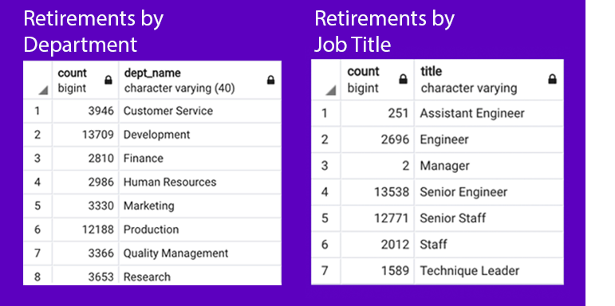
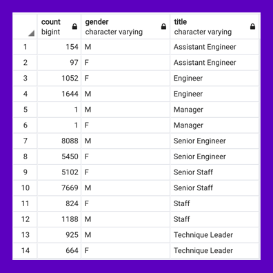
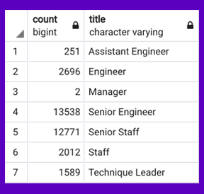
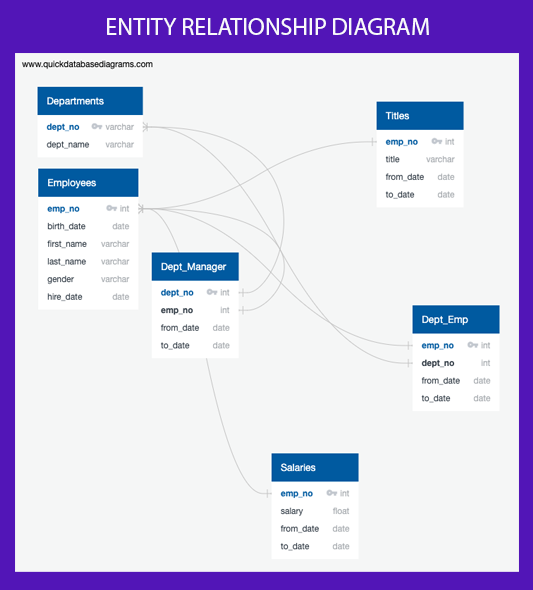

# Pewlett-Hackard-Analysis
Prepared for Pewlett Hackard
by Sharon Karasick
04/28/2020

## Summary
Pewlett-Hackard (PH), a large business extant for over 100 years boasts a robust workforce of nearly a quarter of a million employees.  As a comprehensive employer, employee retention rates show a large number of professionals who commit to the company for the duration of their professional career.  Employees buck trends toward regular, frequent career transitions and appear to seek opportunities to grow within PH, a trait that distinguishes the culture and environment of the company over time. 

This analysis was prompted by a recognition that PH underwent a period of significant growth as the baby-boomer generation entered the workforce.  Obviously, a period of rapid growth is a welcomed boon, but nearly three decades later it is anticipated that the same group of individuals who were hired and retained with PH for their career will be looking toward retirement in the imminent future. 

To cultivate a better understanding of how this retirement event will influence the work environment and culture, multiple lines of inquiry are being investigated, utilizing human resources data available to this consulting firm.  These questions include: 

* How will each job position (employment title) and department differentially be impacted by the exodus of so many employees in such a short period of time?
* How can the deep institutional knowledge that is held by the exiting work population able to be retained and built upon to ensure long-term success?
* And lastly, this firm would like to explore if this significant change in staffing and leadership provides an opportunity to address a concern addressing many 21st century organizations: are we appropriately nurturing diversity in our workforce and leadership roles?  If not, how can we leverage this to diversify our cognitive and social strengths to benefit the overall corporate health and capacity?

## Analysis and Exploration

Pewlett Hackard has 233,086 employees at this time (105,442 total employees who have had one title in their PH career; 127644 who have had more than one).  14.1%, or 32,859, of those employees are anticipated to retire in the next few years.  Of those employees:  
* __% are in a leadership or senior staff role, 
* __% are men, and 
* The following departments will be influenced most significantly: 

###### Influence by Department

###### Influence on Leadership
What are considered the most valuable leadership traits have basically inverted in the past few decades.  Increasingly, the emphasis is on teams, collaboration, communication, creativity and soft skills that require emotional and social intelligence for corporate success.  

Mentorship programs, designed to support current junior/senior employees not currently in direct leadership roles will be essential in cultivating the skills and practices to support business continuity.  However, these programs should be constructed with an eye toward building collaborative teams that can draw out strengths and weaknesses of current business practices and work to build on what works and revise what does not work with the strategic knowledge available from retiring staff. This will also enable more junior staff to feel a sense of ownership in the organizational culture as cross-generational dialogs allow for specific issues to be discussed and addressed in a collaborative environment.  The following employees who are retiring meet the general criteria to serve as mentors in this process on the hard data side (based on employment date, title, and tenure) however, a soft skills analysis is strongly encouraged to ensure that these mentors have the skills required to serve as effective leaders in transitional environments. 

INSERT DATA TABLE ABOUT MENTOR CANDIDATE POOL HERE.

###### Opportunities for Gender Equity

Across all job titles in the retiring candidate pool, a disproportionate number of men versus women have been hired and retained in every position of the organization. This parallels the overall tally of organizational staffing which demonstrates a gender disparity across the organization.  

prepares for substantial change in its workforce, it is wise to consider how these personnel changes will influence structure, form, and operations to guide the organization into the future.  With tens of thousands of employees department the organization in the near term; it is a good time to evaluate what 21st century workplaces and leadership skills will bolster the work of the organization and allow for this substantial change to be one that drives positive change instead of leadership loss.  

While the baby-boomer generation is defined by .... , new leadership models have brought in a great deal of dynamic change to how work environments are established and designed.  These work environments level the field for the participation of underrepresented minorities (URMs) including women and people of other ethnicities and bring diversity to the workforce that allows for progressive advances in business design and operations.  While the institutional wisdom of the old guard is to be treasured and valued, it is always imperative to keep an eye to how the organization is ensuring the ability to rapidly respond to the rapidly changing environment of the workforce today, in this era.

## Exploration

Many of these employees hold positions that are in leadership roles.

_Figure 2: Entity Relationship Diagram

In addition, many of these positions that are being vacated demonstrate the gender gap common among modern workforces with deep intrinsic biases that emerge as a result of rapidly changing cultural norms. 

This will leave many leadership gaps in the organization and an opportunity to spark cultural shifts toward more modern norms in hiring for leadership roles. 

tablewithcount1 = 105442
table with count total = 127644

## Data Exploration
###### Establishing Relationships Between DataSets
* Six separate data files were extracted from the staffing database to complete this data analysis.  Employee number and department number were the most frequently used keys for linking data between data sets.  The relationship between the items is defined and described in the Entity Relationship Diagram included below (Figure 3).

###### Defining the "Retirement Ready" Subset of Employees
* The following individuals were considered to be included in the retirement ready data category: 
  * Having a birth date between 01/1952 and 12/1955
  * Having a hire date with the company between 01/1985 and 12/1988
  * Not having departed from the company already (date of exit from the company is "9999-01-01"

_Figure 3: Entity Relationship Diagram
